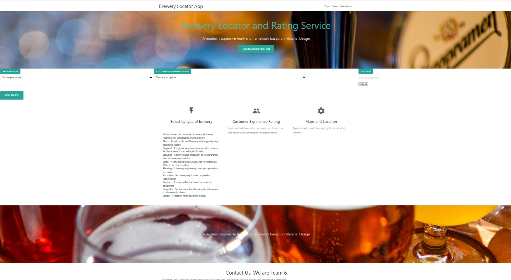
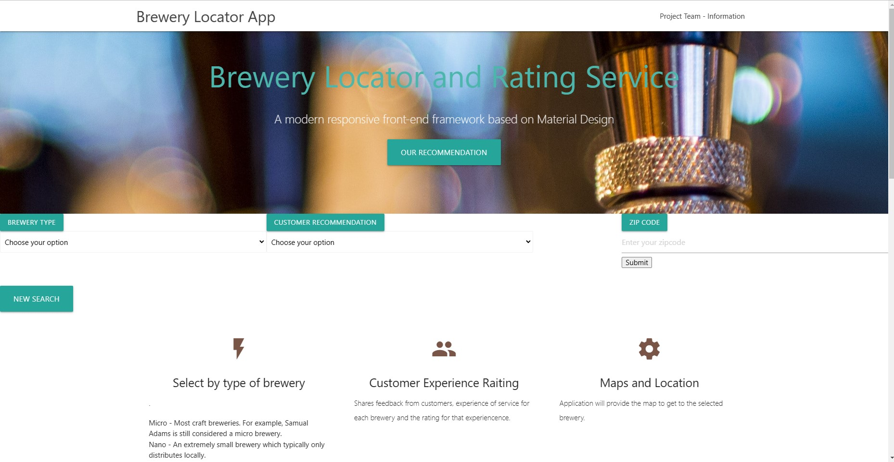
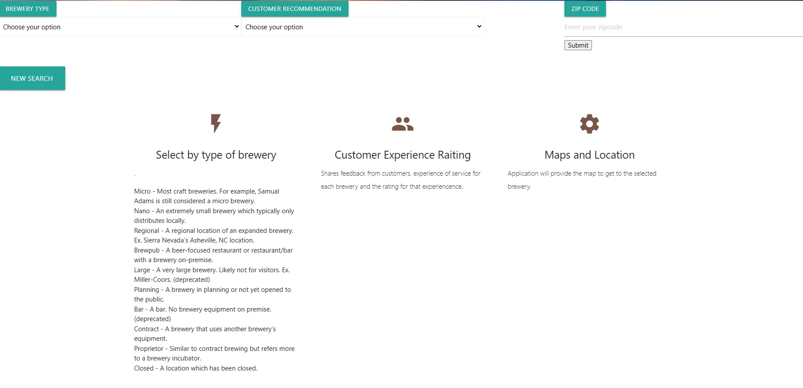
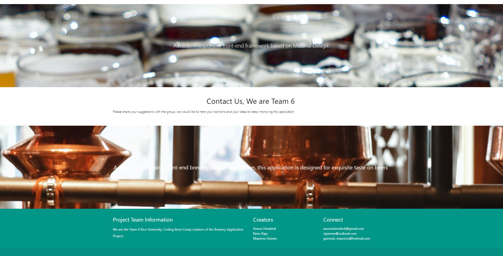
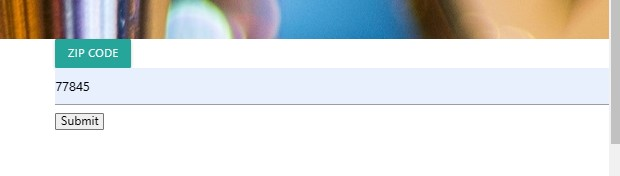
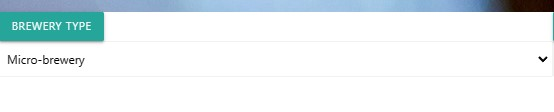
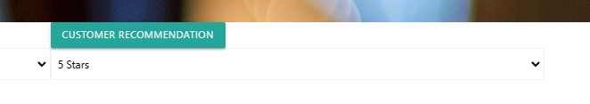
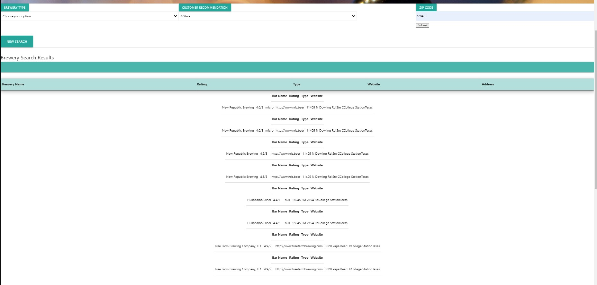
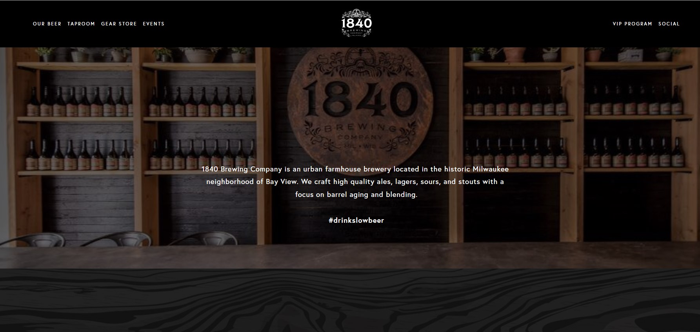

# Project 1 - Brewery locator and rating service website
​​
## Project Summary Description

There is a huge Beer craft fans, find selective type of for enjoy and delightful taste of beers and like to visit and explore local breweries.
Target audience are beer enthusiasts on craft and regular beers that wish to find a local brewery according to their location and search criteria.

This application becomes very relevant due the fact that Beer Craft breweries produce small amounts of high quality and craft beer, total industry has had a huge growth; Retail dollar sales of craft beer increased 21%, to $26.8 billion on 2022. 

The purpose of this application is to create a website that provides the user (consumer of craft beers) an easy way to locate breweries according to rating and location using a zip code.
Application pulls data from different breweries options, location and rating from other customers; this helps user interested in breweries to quickly find multiple options based on their type of beer, location and select their rating.

Application uses external API to collect and display the Breweries data.

## Team Developers

​Project 1 - Team 6
- Anson Hendrick,     ​ansonshendrick@gmail.com
- Reno Raju,          rajureno@outlook.com  
- Mauricio Gomez,     gomezb_mauricio@hotmail.com

## Table of Contents

- [Installation](#installation)
- [Usage](#usage)
- [APIs](#APIs)
- [Tech-Stack](#Tech-Stack)
- [Credits](#credits)
- [License](#license)

## Installation

The actual front-end application does not require to be installed on local drive. This application can be used directly from the browser. 
Links to API,  jQuery, CSS style framework  are already included in the HTML section; all of them  will run by the browser.

Link to GitHub Depository:

https://github.com/MauricioGB1/Project-1-Brewery-locator-and-rating-service-website-Group-6

Link to the WEB deployed application and ready to run from the browser:

https://mauriciogb1.github.io/Project-1-Brewery-locator-and-rating-service-website-Group-6/

## Usage

Brewery locator and rating serviced is very intuitive and user friendly

User will be promoted with the main page.

User Input Selection Section, with buttons to input Brewery type, Customer rating and Zip code.

User can read the explanation for each of the Brewery types.

Bottom Section of the Web App with the Creators and additional links information.

User needs to enter a minimum the located location, ZIP Code.

Additional information is the Brewery Type. also can be left blank and it will work.

Additional information is the Rating criteria, it also can be left blank and it will work.

Display area after click Zip Code search, results will be presented on the following format:

For New search click the corresponding button- SEARCH:

Our recommendation is an option to search the Best Place recommended by the App:

Location of the recommended Brewery.

## APIs
​- Open Brewery DB https://www.openbrewerydb.org/
   (Open Brewery DB is a free dataset and API with public information on breweries, cideries, brewpubs, and bottle shops)
- Google Maps: https://developers.google.com/maps/
- maps.googleapis.com Google Reviews: The Google My Business API 
- Maps JavaScript API : https://developers.google.com/maps/documentation/javascript/places

## Tech-Stack
​
Application was created using the following coding languages, search and style framework.

- What languages is it written with: 
​- HTML
- JavaScript
- CSS
- jQuery
- Style-API Materialize CSS   https://materializecss.com/
- fetch
- JSON
​
## Credits

Special Thank you to the RICE University Coding Instructors Team.

- Brandon Gatlin
- Bradley Boyd

-  Images provided by https://www.pexels.com/

- Style Framework : Materialize https://materializecss.com/

- Open Brewery DB https://www.openbrewerydb.org/

- Maps JavaScript API : https://developers.google.com/maps/documentation/javascript/places

## License

Website running under MIT License.

## Features

- Use of external API

- Use of CSS Style framework

- Intuitive application

- Search triggered by location

- Display results using Fetch and JSON

- Storage of Data

- Use of jQuery

